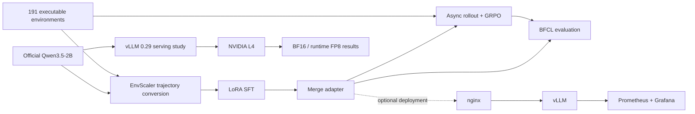

# smolqwen — Post-training, evaluating, and serving Qwen3.5-2B on one L4

[](https://github.com/qninhdt/smolqwen/actions/workflows/ci.yml)
[](LICENSE)

An end-to-end engineering project for adapting the trajectories and executable
environments released with EnvScaler to a Transformers + TRL stack. It implements
LoRA SFT, asynchronous environment rollouts, GRPO, pinned BFCL evaluation, and a
measured vLLM serving stack under a single NVIDIA L4 constraint.

The repository reports completed measurements only, never unfinished SFT or GRPO runs.

## Key results

| Result | Measurement |
|---|---:|
| SFT trajectories converted | 9,022 |
| Official Qwen → SFT BFCL multi-turn Base | 19.0% → 24.0% (+5 pp) |
| L4 serving study | 32 BF16/FP8 measurements |
| Peak FP8 output throughput | 1,490.55 tokens/s |
| Median matched-config FP8 uplift | 25.94% |

The serving study has one observation per configuration, so its point values are
not medians and carry no variance estimate. The 25.94% figure is the median across
the 16 paired FP8-versus-BF16 throughput uplifts.

## Problem

Given:

- the official `Qwen/Qwen3.5-2B` checkpoint;
- EnvScaler trajectories and 191 executable Python environments;
- one NVIDIA L4 with 24 GB VRAM.

The project aims to:

1. reproduce a pinned tool-use baseline;
2. provide one coherent SFT and asynchronous GRPO implementation;
3. evaluate checkpoints with an external executable benchmark;
4. characterize realistic serving throughput and latency on the target GPU.

## System overview



## Post-training

The project consumes released EnvScaler assets; it does not claim to have created
EnvScaler, its environments, or its teacher trajectories. The original training
stack is replaced with a shared Hugging Face Transformers + TRL implementation.

Implemented components include:

- deterministic conversion of 9,022 teacher trajectories;
- Qwen3.5 chat-template rendering and loss masking;
- LoRA SFT and checkpoint merge;
- isolated executable-environment workers and deterministic verifiers;
- independently scheduled episodes that avoid blocking a rollout batch on one
  slow environment;
- masked log-probabilities, grouped rewards, and GRPO updates;
- local, W&B, and Hugging Face artifact boundaries.

The full training implementation is documented in
[GRPO](docs/grpo.md), [rollouts](docs/rollout.md), and the
[optimization ledger](docs/optimization-ledger.md).

## Evaluation

Evaluation runs the pinned BFCL `multi_turn_base` category through an in-process
vLLM engine. Checkpoint revisions, decoding, prompts, tool schemas, and termination
reasons are recorded so incomparable runs cannot silently enter one table.

| Checkpoint | BFCL multi-turn Base | Status |
|---|---:|---|
| Official Qwen3.5-2B | 19.0% (38/200) | Measured |
| SFT | 24.0% (48/200) | Measured |
| SFT + GRPO | — | Not reported |

The Base run completed 173 tasks normally and ended 27 at the configured step cap;
SFT completed 148 and ended 52 at the cap. Both are one run, not confidence
intervals or a state-of-the-art claim. Raw trajectory evidence is committed under
`artifacts/evaluation/`.

SFT and GRPO infrastructure is implemented and integration-tested. The SFT score
improves by 5 percentage points, but its invalid calls also rise from 383 to 1,386;
the result should not be read as an unconditional quality improvement. No GRPO
quality result is reported because the available compute budget did not support a
meaningful complete run.

See [Evaluation](docs/evaluation.md) for the execution and interpretation
contract.

## Serving architecture

The measured benchmark is deliberately smaller than the optional deployment
stack:

```text
Benchmark:  vllm bench sweep serve → vLLM 0.29 → NVIDIA L4
                                              └→ native /metrics

Deployment: client → nginx → vLLM 0.29 → NVIDIA L4
                       │         └→ paged KV / batching / chunked prefill
                       └→ authentication, SSE proxying, timeouts

             vLLM /metrics → Prometheus → Grafana
```

One engine owns the single GPU. There is no FastAPI wrapper or second KV tier
because neither is needed by the measured deployment. The raw vLLM port stays
private; nginx is the optional authenticated ingress.

## Serving benchmark

| Item | Value |
|---|---|
| GPU | NVIDIA L4 24 GB |
| Model | Official `Qwen/Qwen3.5-2B`, pinned revision |
| Engine | vLLM 0.29.0, Torch 2.13.0+cu130 |
| Precisions | BF16 and runtime FP8 |
| Workload | Fixed BFCL serving workload |
| Requests/config | 200 successful requests |
| Study | 16 selected configs × 2 precisions × 1 observation |

The 16 points cover low-load, knee, and saturation regions. They are not a
Cartesian product of every token budget, sequence limit, and concurrency.

### Scaling


### Matched FP8 uplift


### Throughput–TTFT frontier


| Profile | Precision | Token budget | Max seqs | Concurrency | Output tok/s | p95 TTFT | p95 TPOT |
|---|---|---:|---:|---:|---:|---:|---:|
| Latency | FP8 | 2,048 | 16 | 1 | 79.85 | 64.1 ms | 12.22 ms |
| Balanced / knee | FP8 | 2,048 | 32 | 32 | 1,055.57 | 784.0 ms | 26.81 ms |
| Throughput | FP8 | 2,048 | 128 | 128 | 1,490.55 | 4.18 s | 84.89 ms |

Main observations:

- FP8 improved output throughput at every matched point; median uplift was 25.94%.
- The useful throughput/latency knee appeared around concurrency 16–32.
- Concurrency 64→128 added modest throughput while sharply increasing TTFT and TPOT.
- At concurrency 128, lowering `max_num_seqs` to 64 reduced TPOT but increased
  TTFT because more requests waited in the scheduler queue.

See [Measured serving performance](docs/performance.md) for all 32 rows and four figures.

## Runtime separation

| Workflow | Runtime | Reason |
|---|---|---|
| SFT, GRPO, in-process evaluation | vLLM 0.26 / Torch 2.11 environment | Shares the pinned training-kernel ABI |
| Serving benchmark and deployment | vLLM 0.29 / Torch 2.13 environment | Isolated serving runtime measured on L4 |

No serving result in this repository comes from vLLM 0.26. The two environments
are intentionally isolated; the misleading `serve` Python extra has been removed.

## Quick start

Clone the pinned submodules and install the development environment:

```bash
git clone --recurse-submodules https://github.com/qninhdt/smolqwen.git
cd smolqwen
uv sync --dev
```

Inspect the main stages without starting GPU work:

```bash
uv run smolqwen prepare-sft --dry-run
uv run smolqwen train-sft --profile l4 --dry-run
uv run smolqwen evaluate --profile l4 --checkpoint Qwen/Qwen3.5-2B \
  --revision 15852e8c16360a2fea060d615a32b45270f8a8fc --dry-run
uv run smolqwen serve --profile balanced --print-command
```

On a supported GPU environment, run `bash scripts/setup_colab.sh`, then remove
`--dry-run`. Command-specific options are available through `--help`.

Regenerate serving outputs from committed evidence without a GPU:

```bash
uv run python benchmarks/serving/analyze.py
```

Optional local deployment:

```bash
export VLLM_API_KEY="$(openssl rand -hex 32)"
MODEL_PATH=/absolute/path/to/checkpoint \
SMOLQWEN_PROFILE=balanced \
docker compose up --build vllm-server proxy
```

See [Serving](docs/serving.md) for validation and observability commands.

## Repository structure

| Path | Purpose |
|---|---|
| `src/smolqwen/` | Data, training, rollout, evaluation, and serving code |
| `configs/` | Experiment semantics, GPU profiles, and measured serving profiles |
| `benchmarks/`, `artifacts/` | Frozen studies, analyzers, and measured evidence |
| `serving/` | nginx, Prometheus, Grafana, and container assets |
| `tests/`, `docs/` | Contract tests and detailed engineering documentation |

## Limitations

- All reported serving measurements use one NVIDIA L4 and one vLLM engine.
- Each serving point has one observation; no variance or confidence interval is claimed.
- Runtime FP8 quality was not evaluated; the official checkpoint has no calibrated
  FP8 attention scales.
- Qwen3.5 GDN prefix-caching validation observed queries but no cache hits; profiles
  do not rely on APC reuse.
- The SFT result is one run with more invalid calls and step caps than Base; GRPO
  quality is not reported.
- The project does not claim multi-node scalability or state-of-the-art quality.

## Acknowledgements

Built on [Qwen3.5](https://huggingface.co/Qwen/Qwen3.5-2B), [EnvScaler](https://github.com/RUC-NLPIR/EnvScaler),
[BFCL](https://github.com/ShishirPatil/gorilla), [TRL](https://github.com/huggingface/trl), and [vLLM](https://github.com/vllm-project/vllm).
Pinned submodules retain their upstream licenses.

## License

Project-owned code is released under the [MIT License](LICENSE).
