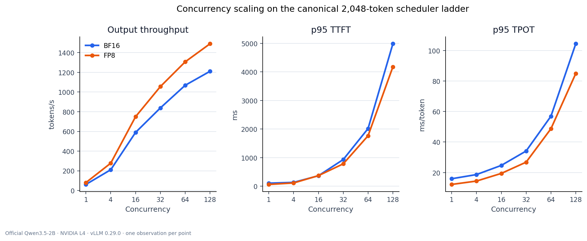
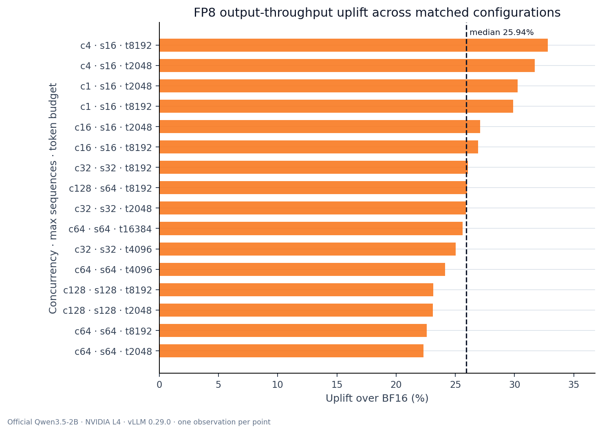
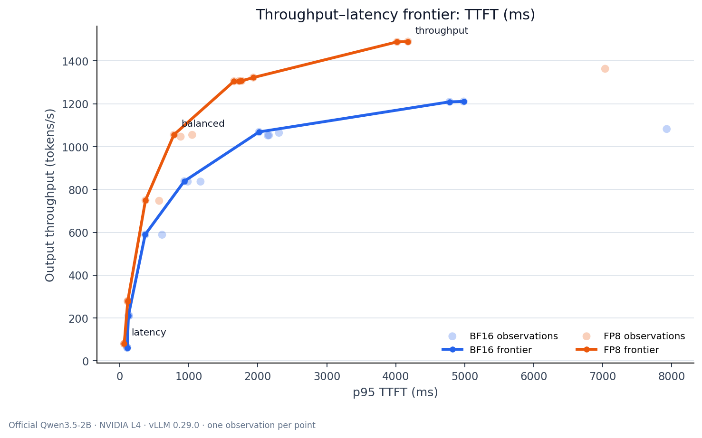
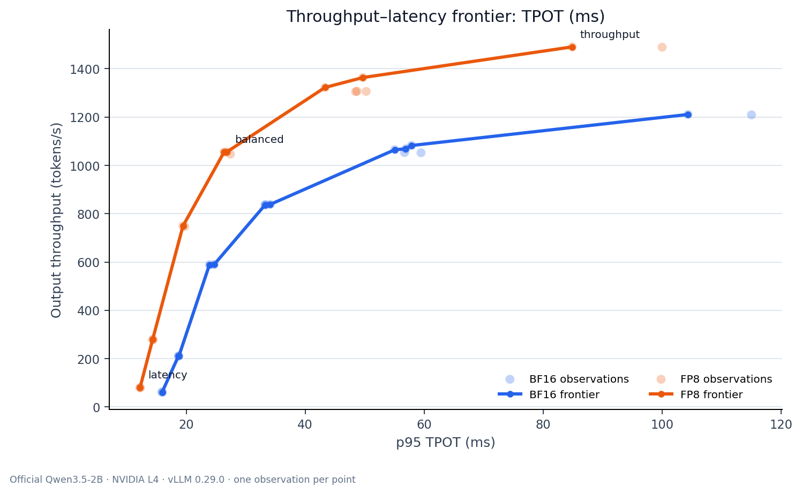

# Measured serving performance

The authority for exact values is the generated
[`artifacts/serving/report.md`](../artifacts/serving/report.md). It is derived
from the committed native vLLM JSON and Prometheus snapshots by
`benchmarks/serving/analyze.py`.

## Reproducibility

| Item | Value |
|---|---|
| Model | Official `Qwen/Qwen3.5-2B`, pinned revision |
| GPU | NVIDIA L4 24 GB |
| Runtime | vLLM 0.29.0, Torch 2.13.0+cu130 |
| Precision families | BF16 and runtime FP8 |
| Workload | Fixed BFCL serving workload |
| Requests/config | 200 successful |
| Study size | 16 configs × 2 precisions |
| Repetitions | 1 |
| Prompt length p95 | 808 tokens |

## Selected operating points

| Profile | Precision | tok | seq | c | output tok/s | p95 TTFT | p95 TPOT |
|---|---|---:|---:|---:|---:|---:|---:|
| Latency | FP8 | 2,048 | 16 | 1 | 79.85 | 64.1 ms | 12.22 ms |
| Balanced / knee | FP8 | 2,048 | 32 | 32 | 1,055.57 | 784.0 ms | 26.81 ms |
| Throughput | FP8 | 2,048 | 128 | 128 | 1,490.55 | 4.18 s | 84.89 ms |

These are deterministic selections over measured throughput, p95 TTFT, and p95
TPOT. “Balanced” does not mean that an unstated application SLO is satisfied.

## Figures

### Concurrency scaling



The canonical ladder keeps the token budget at 2,048 and scales
`max_num_seqs` with concurrency after concurrency 16. Throughput continues to
increase, but both latency metrics bend sharply beyond 32–64 concurrent requests.

### Matched FP8 uplift



FP8 improved output throughput at all 16 matched points. The median uplift is
25.94%, with observed matched-point uplifts from 22.31% to 32.79%.

### Throughput versus p95 TTFT



### Throughput versus p95 TPOT



## Interpretation

- FP8 moved the throughput frontier outward at every measured load.
- The practical throughput/latency knee appeared around concurrency 16–32.
- Concurrency 64→128 added modest throughput while sharply increasing both TTFT
  and TPOT.
- At concurrency 128, `max_num_seqs=64` reduced TPOT relative to 128 active
  sequences but moved delay into scheduler waiting, increasing TTFT.
- Token-budget changes at a fixed load usually had much less impact than
  concurrency and active sequence capacity.

## Full data

The generated report contains:

- all 32 measurements;
- all 16 matched BF16/FP8 comparisons;
- selected admission limits;
- workload and summary hashes.

Use:

```bash
uv run python benchmarks/serving/analyze.py
```

Regeneration reads local evidence only and does not contact a GPU.

## Limitations

- Each point is one observation, not a median or variance estimate.
- Post-run Prometheus snapshots prove counters and clean end state; they are not
  peak KV/running/waiting measurements.
- Runtime FP8 uses the official BF16 checkpoint without calibrated FP8 attention
  scales. No serving-quality equivalence claim is made.
- APC validation observed no reusable prefix hit for Qwen3.5 GDN align mode.
- Queue limits remain provisional until an application supplies TTFT/TPOT SLOs.
- The results characterize one engine on one L4, not multi-node serving.
